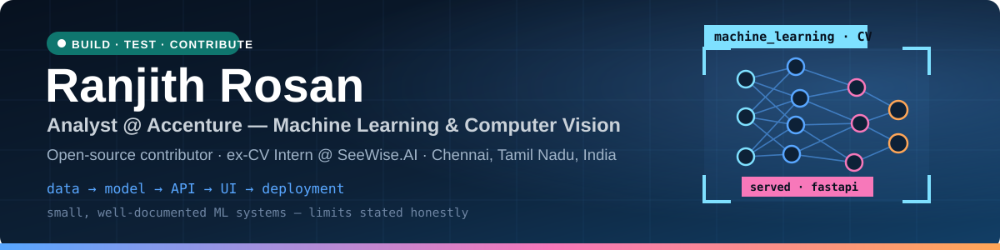

  
  
  

  <a href="#stats">📊 Live dashboard</a> &nbsp;·&nbsp;
  <a href="#open-source">🌍 Open source</a> &nbsp;·&nbsp;
  <a href="#projects">🚀 Projects</a> &nbsp;·&nbsp;
  <a href="#experience">💼 Experience</a> &nbsp;·&nbsp;
  <a href="#contact">📫 Contact</a>

I build small, well-documented systems end to end — **data → model → API → UI → deployment** — and contribute fixes to the open-source tools I use. **Analyst at Accenture**; previously a **computer vision intern**. I care about honest evaluation, reproducible fixes and maintainable tooling.

## 📊 GitHub, in living color

Not a decorative score. These charts are rendered from my public GitHub data, refreshed daily, and versioned together so the numbers and pictures agree.

<!-- DYNAMIC:VISUAL_PULSE:START -->
<picture><source media="(prefers-color-scheme: dark)" srcset="./assets/generated/pulse.dark.svg?v=bf0e30714342" /></picture>
<!-- DYNAMIC:VISUAL_PULSE:END -->

<!-- DYNAMIC:CONTRIBUTION_GRAPH:START -->
<picture><source media="(prefers-color-scheme: dark)" srcset="./assets/generated/contributions.dark.svg?v=60dcc7ad5752" /></picture>
<!-- DYNAMIC:CONTRIBUTION_GRAPH:END -->

<!-- DYNAMIC:INSIGHT_CHARTS:START -->

<picture><source media="(prefers-color-scheme: dark)" srcset="./assets/generated/upstream.dark.svg?v=1f27f7203ed5" /></picture>
<picture><source media="(prefers-color-scheme: dark)" srcset="./assets/generated/languages.dark.svg?v=542a42f378d7" /></picture>

<!-- DYNAMIC:INSIGHT_CHARTS:END -->

**Read the signal honestly:** merged means accepted upstream; open means still in review. Language share measures repository bytes, not skill. The calendar shows public activity visible to GitHub Actions. Every chart has a text alternative, light/dark artwork, and a dated, machine-readable snapshot.

  <a href="./data/profile-snapshot.json">🔎 Inspect the data</a> &nbsp;·&nbsp;
  <a href="./data/profile-history.json">📈 Daily metric history</a> &nbsp;·&nbsp;
  <a href="./docs/AUTOMATION.md">⚙️ How it stays live</a>

### 🔭 What I'm focused on now

- **MCP security & AI infrastructure** — [Vexar-MCP](https://github.com/RANJITHROSAN17/Vexar-MCP) and [vexar-autofix](https://github.com/RANJITHROSAN17/vexar-autofix): static analysis, CI policy gates and reviewable patches
- **Local-first AI & developer tools** — [Quasnooze](https://github.com/Quasynvo/Quasnooze) and [Wrytrove](https://github.com/RANJITHROSAN17/Wrytrove)
- **Machine learning & computer vision** — object detection, auto-labelling, model cards and honest evaluation
- **Research & systems code** — maintenance fixes in large, unfamiliar codebases, from ML infrastructure to shader transpilers
- **Building in public** — documented setup, tests or live demos, and limitations stated clearly

---

## 🌍 Open source — work that landed, not just work I opened

<!-- DYNAMIC:OSS_SUMMARY:START -->
> **94 pull requests to 52 external projects** · [**23 merged upstream**](https://github.com/search?q=type%3Apr%20author%3ARANJITHROSAN17%20is%3Amerged%20-user%3ARANJITHROSAN17%20-org%3AQuasynvo%20-org%3Apinchfoundry&type=pullrequests) · [**7 in review right now**](https://github.com/search?q=type%3Apr%20author%3ARANJITHROSAN17%20is%3Aopen%20-user%3ARANJITHROSAN17%20-org%3AQuasynvo%20-org%3Apinchfoundry&type=pullrequests) · auto-updated 14 Nov 2026 - every number below links to a live search you can verify.
>
> Status key: 🟣 **Merged** = merged upstream &nbsp;·&nbsp; 🟢 **In review** = open PR, not yet merged - I don't claim orgs I haven't landed in (yet).
<!-- DYNAMIC:OSS_SUMMARY:END -->

<!-- DYNAMIC:OSS_SNAPSHOT:START -->
**🟣 Merged upstream in:** [CrossGL](https://github.com/CrossGL/crosstl) · [Kubeflow](https://github.com/kubeflow/mcp-server) · [Ultralytics](https://github.com/ultralytics/yolov3) · [Amazon Web Services](https://github.com/aws-samples/step-functions-workflows-collection) · [Opencollab MCP](https://github.com/prakhar1605/Opencollab-mcp) · [Golang Cafe](https://github.com/golang-cafe/job-board) · +6 merged PRs in other projects

**🟢 Currently in review at:** [Kubeflow](https://github.com/kubeflow/mcp-server)
<!-- DYNAMIC:OSS_SNAPSHOT:END -->

<!-- DYNAMIC:OSS_TABLE:START -->
| Organisation | Project | What my PRs touch | 🟣 Merged | 🟢 In review | Latest PR |
|---|---|---|---:|---:|---|
|  **CrossGL** | [CrossGL/crosstl](https://github.com/CrossGL/crosstl) (★2.2k) | Shader transpiler (GLSL/HLSL/Metal/SPIR-V/Slang/WGSL) - backend lowering, resource binding & provenance, conformance harness | 10 | · | 🟣 [#3050](https://github.com/CrossGL/crosstl/pull/3050) |
|  **Kubeflow** | [kubeflow/mcp-server](https://github.com/kubeflow/mcp-server) (★59) | MCP server for Kubeflow Trainer - rate-limit/circuit-breaker & RED metrics, schedulable-GPU counting, training lifecycle fixes | 1 | 7 | 🟣 [#479](https://github.com/kubeflow/mcp-server/pull/479) |
|  **Ultralytics** | [ultralytics/yolov3](https://github.com/ultralytics/yolov3) (★11k) | YOLOv3 object detection - requirements fix | 1 | · | 🟣 [#2333](https://github.com/ultralytics/yolov3/pull/2333) |
|  **Amazon Web Services** | [aws-samples/step-functions-workflows-collection](https://github.com/aws-samples/step-functions-workflows-collection) (★281) | AWS Step Functions workflow collection - template update | 1 | · | 🟣 [#283](https://github.com/aws-samples/step-functions-workflows-collection/pull/283) |
|  **Opencollab MCP** | [prakhar1605/Opencollab-mcp](https://github.com/prakhar1605/Opencollab-mcp) (★43) | Contribution-matchmaking MCP - shared GitHub paginator, closing-PR vs. plain-mention detection | 2 | · | 🟣 [#216](https://github.com/prakhar1605/Opencollab-mcp/pull/216) |
|  **Golang Cafe** | [golang-cafe/job-board](https://github.com/golang-cafe/job-board) (★228) | Go job board - golangci-lint workflow updates | 2 | · | 🟣 [#121](https://github.com/golang-cafe/job-board/pull/121) |

Plus 6 earlier merged PRs in smaller projects - [see every upstream-merged PR](https://github.com/search?q=type%3Apr%20author%3ARANJITHROSAN17%20is%3Amerged%20-user%3ARANJITHROSAN17%20-org%3AQuasynvo%20-org%3Apinchfoundry&type=pullrequests).
<!-- DYNAMIC:OSS_TABLE:END -->

<!-- DYNAMIC:OSS_DETAILS:START -->

<strong>📂 Expand — every featured PR, grouped by organisation (auto-updated)</strong>

####  CrossGL — [CrossGL/crosstl](https://github.com/CrossGL/crosstl) · 10 merged · 0 in review

- 🟣 Merged · 2026-10-26 · [Refuse HLSL dx::MaybeReorderThread for targets other than Direct3D](https://github.com/CrossGL/crosstl/pull/3050)
- 🟣 Merged · 2026-10-25 · [Keep integer min and max integer in CUDA and HIP output](https://github.com/CrossGL/crosstl/pull/3067)
- 🟣 Merged · 2026-10-25 · [Wrap 8- and 16-bit scalar integer arithmetic in GLSL](https://github.com/CrossGL/crosstl/pull/3041)
- 🟣 Merged · 2026-10-25 · [Preserve resource provenance for pointer-bearing aggregate members](https://github.com/CrossGL/crosstl/pull/3046)
- 🟣 Merged · 2026-10-25 · [Bind multiple input buffers in the conformance harness](https://github.com/CrossGL/crosstl/pull/2937)
- 🟣 Merged · 2026-10-25 · [Keep generated include order when formatting with clang-format](https://github.com/CrossGL/crosstl/pull/3056)
- 🟣 Merged · 2026-10-25 · [Assign implicit WGSL resources to the lowest free bindings](https://github.com/CrossGL/crosstl/pull/3037)
- 🟣 Merged · 2026-10-25 · [fix(slang): lower bitCount, findMSB, findLSB and bitfieldReverse](https://github.com/CrossGL/crosstl/pull/3047)
- 🟣 Merged · 2026-10-25 · [Declare CrossGL storage buffers as structured buffers in Slang](https://github.com/CrossGL/crosstl/pull/2943)
- 🟣 Merged · 2026-10-21 · [Fix parser hang on unterminated shader declarations](https://github.com/CrossGL/crosstl/pull/2443)

####  Kubeflow — [kubeflow/mcp-server](https://github.com/kubeflow/mcp-server) · 1 merged · 7 in review

- 🟣 Merged · 2026-11-10 · [fix(trainer): stop wait_for_training early when the job is already Complete](https://github.com/kubeflow/mcp-server/pull/479)
- 🟢 In review · 2026-11-02 · [fix(trainer): report a missing step instead of an empty log in get_training_logs](https://github.com/kubeflow/mcp-server/pull/471)
- 🟢 In review · 2026-11-02 · [fix(trainer): round GPU memory estimates up before picking a tier](https://github.com/kubeflow/mcp-server/pull/476)
- 🟢 In review · 2026-11-02 · [fix(trainer): count only schedulable GPUs, from any vendor, in get_cluster_resources](https://github.com/kubeflow/mcp-server/pull/477)
- 🟢 In review · 2026-11-01 · [feat(core): add HTTP RED metrics and a readiness gauge](https://github.com/kubeflow/mcp-server/pull/473)
- 🟢 In review · 2026-11-01 · [feat(core): add rate-limit and circuit-breaker metrics](https://github.com/kubeflow/mcp-server/pull/472)
- 🟢 In review · 2026-10-28 · [fix(core): validate logging format values across configuration sources](https://github.com/kubeflow/mcp-server/pull/487)
- 🟢 In review · 2026-10-23 · [fix(ci): harden E2E dependency cache isolation](https://github.com/kubeflow/mcp-server/pull/440)

####  Ultralytics — [ultralytics/yolov3](https://github.com/ultralytics/yolov3) · 1 merged · 0 in review

- 🟣 Merged · 2025-06-06 · [Update requirements.txt](https://github.com/ultralytics/yolov3/pull/2333)

####  Amazon Web Services — [aws-samples/step-functions-workflows-collection](https://github.com/aws-samples/step-functions-workflows-collection) · 1 merged · 0 in review

- 🟣 Merged · 2023-09-04 · [Update template.yaml](https://github.com/aws-samples/step-functions-workflows-collection/pull/283)

####  Opencollab MCP — [prakhar1605/Opencollab-mcp](https://github.com/prakhar1605/Opencollab-mcp) · 2 merged · 0 in review

- 🟣 Merged · 2026-10-21 · [fix(client): add shared github_get_all paginator and paginate issue timelines](https://github.com/prakhar1605/Opencollab-mcp/pull/216)
- 🟣 Merged · 2026-10-20 · [fix(issues): distinguish closing PRs from plain mentions in check_issue_availability](https://github.com/prakhar1605/Opencollab-mcp/pull/215)

####  Golang Cafe — [golang-cafe/job-board](https://github.com/golang-cafe/job-board) · 2 merged · 0 in review

- 🟣 Merged · 2023-05-03 · [Update golangci-lint.yml](https://github.com/golang-cafe/job-board/pull/121)
- 🟣 Merged · 2023-05-02 · [Update golangci-lint.yml](https://github.com/golang-cafe/job-board/pull/119)

<!-- DYNAMIC:OSS_DETAILS:END -->

<strong>⚡ Latest merged & in-review pull requests</strong>

<!-- DYNAMIC:RECENT_PRS:START -->
- 🟣 Merged · 2026-11-10 · [fix(trainer): stop wait_for_training early when the job is already Complete](https://github.com/kubeflow/mcp-server/pull/479) in [kubeflow/mcp-server](https://github.com/kubeflow/mcp-server)
- 🟢 In review · 2026-11-02 · [fix(trainer): report a missing step instead of an empty log in get_training_logs](https://github.com/kubeflow/mcp-server/pull/471) in [kubeflow/mcp-server](https://github.com/kubeflow/mcp-server)
- 🟢 In review · 2026-11-02 · [fix(trainer): round GPU memory estimates up before picking a tier](https://github.com/kubeflow/mcp-server/pull/476) in [kubeflow/mcp-server](https://github.com/kubeflow/mcp-server)
- 🟣 Merged · 2026-10-26 · [Refuse HLSL dx::MaybeReorderThread for targets other than Direct3D](https://github.com/CrossGL/crosstl/pull/3050) in [CrossGL/crosstl](https://github.com/CrossGL/crosstl)
- 🟣 Merged · 2026-10-25 · [Keep integer min and max integer in CUDA and HIP output](https://github.com/CrossGL/crosstl/pull/3067) in [CrossGL/crosstl](https://github.com/CrossGL/crosstl)
- 🟣 Merged · 2026-10-25 · [Wrap 8- and 16-bit scalar integer arithmetic in GLSL](https://github.com/CrossGL/crosstl/pull/3041) in [CrossGL/crosstl](https://github.com/CrossGL/crosstl)
- 🟣 Merged · 2026-10-21 · [fix(client): add shared github_get_all paginator and paginate issue timelines](https://github.com/prakhar1605/Opencollab-mcp/pull/216) in [prakhar1605/Opencollab-mcp](https://github.com/prakhar1605/Opencollab-mcp)
- 🟣 Merged · 2026-10-20 · [fix(issues): distinguish closing PRs from plain mentions in check_issue_availability](https://github.com/prakhar1605/Opencollab-mcp/pull/215) in [prakhar1605/Opencollab-mcp](https://github.com/prakhar1605/Opencollab-mcp)
- 🟣 Merged · 2025-06-06 · [Update requirements.txt](https://github.com/ultralytics/yolov3/pull/2333) in [ultralytics/yolov3](https://github.com/ultralytics/yolov3)
- 🟣 Merged · 2023-09-05 · [update on icpp.toml](https://github.com/icppWorld/icpp-pro/pull/10) in [icppWorld/icpp-pro](https://github.com/icppWorld/icpp-pro)
- 🟣 Merged · 2023-09-04 · [Update template.yaml](https://github.com/aws-samples/step-functions-workflows-collection/pull/283) in [aws-samples/step-functions-workflows-collection](https://github.com/aws-samples/step-functions-workflows-collection)
- 🟣 Merged · 2023-05-23 · [Update little_anyhow.rs](https://github.com/EricCrosson/git-disjoint/pull/304) in [EricCrosson/git-disjoint](https://github.com/EricCrosson/git-disjoint)
<!-- DYNAMIC:RECENT_PRS:END -->

### 🤝 How I contribute

**Reproduce first, patch second.** Start with the failing case, make the smallest defensible change, add tests where the project has a harness, and stay on the PR thread through review.

---

## 🚀 Find a project by what you want to do

| Your goal | Start here | Evaluation boundary |
|---|---|---|
| Check an MCP server before shipping | [Vexar-MCP](https://github.com/RANJITHROSAN17/Vexar-MCP#quick-start) | Static findings and coverage, not a security certification |
| Explore reviewable model-generated fixes | [vexar-autofix](https://github.com/RANJITHROSAN17/vexar-autofix#quickstart) | Start with mock mode and a disposable clone |
| Run an assistant on your own device | [Quasnooze](https://github.com/Quasynvo/Quasnooze) | Local model default; powerful tools need careful review |
| Try a lightweight Windows editor | [Wrytrove](https://github.com/RANJITHROSAN17/Wrytrove#get-started) | Early preview; check release signing notes and use non-critical files |
| Learn everyday Kannada | [Kannada Saathi](https://ranjithrosan17.github.io/Kannada-Digital/) | Browser learning aid, not a professional interpreter |
| Practice interview problem-solving | [DSA Mastery Plan](https://ranjithrosan17.github.io/dsa-mastery-plan-2026/) | Browser progress; export a backup |

For research and notebook projects, read their data and evaluation limitations before interpreting metrics. An open PR is not an endorsement by its upstream organisation.

### Selected builds · live repository cards

<!-- DYNAMIC:PROJECT_CARDS:START -->

<a href="https://github.com/RANJITHROSAN17/Vexar-MCP"><picture><source media="(prefers-color-scheme: dark)" srcset="./assets/generated/project-ranjithrosan17-vexar-mcp.dark.svg?v=71efc03cd633" /></picture></a>
<a href="https://github.com/RANJITHROSAN17/vexar-autofix"><picture><source media="(prefers-color-scheme: dark)" srcset="./assets/generated/project-ranjithrosan17-vexar-autofix.dark.svg?v=e81ea4551adc" /></picture></a>
<a href="https://github.com/Quasynvo/Quasnooze"><picture><source media="(prefers-color-scheme: dark)" srcset="./assets/generated/project-quasynvo-quasnooze.dark.svg?v=be62836592ea" /></picture></a>
<a href="https://github.com/RANJITHROSAN17/Wrytrove"><picture><source media="(prefers-color-scheme: dark)" srcset="./assets/generated/project-ranjithrosan17-wrytrove.dark.svg?v=878eeeec5467" /></picture></a>
<a href="https://github.com/RANJITHROSAN17/Kannada-Digital"><picture><source media="(prefers-color-scheme: dark)" srcset="./assets/generated/project-ranjithrosan17-kannada-digital.dark.svg?v=74d7230ced82" /></picture></a>
<a href="https://github.com/RANJITHROSAN17/cardiolens-3d-risk"><picture><source media="(prefers-color-scheme: dark)" srcset="./assets/generated/project-ranjithrosan17-cardiolens-3d-risk.dark.svg?v=1c4a58db4321" /></picture></a>

<!-- DYNAMIC:PROJECT_CARDS:END -->

<strong>📋 Compare all featured projects — descriptions, stack, stars and last push</strong>

<!-- DYNAMIC:PROJECTS:START -->
| Project | What it is | Stack | ★ | Language | Last push |
|---|---|---|---:|---|---|
| **[CardioLens 3D](https://github.com/RANJITHROSAN17/cardiolens-3d-risk)** · [live demo](https://ranjithrosan17.github.io/cardiolens-3d-risk/) | Research-only coronary-artery visualisation - interactive three.js schematic + scikit-learn baseline served from FastAPI, with a model card and documented limits (not for clinical use) | React - three.js - FastAPI - scikit-learn | 3 | JavaScript | 2026-11-14 |
| **[Quasnooze](https://github.com/Quasynvo/Quasnooze)** | A private, local-first personal AI assistant for Telegram, Discord, Slack, WhatsApp and the phone browser - permission-gated tools, reminders and token streaming | Node.js - Ollama - MCP - PWA - zero runtime deps | 14 | JavaScript | 2026-11-13 |
| **[Vexar-MCP](https://github.com/RANJITHROSAN17/Vexar-MCP)** · [live demo](https://ranjithrosan17.github.io/Vexar-MCP/) | Security, schema and token-cost scanner for MCP servers - static analysis that never runs your code, CI policy gates, SARIF output, and an explicit 'n/a' when a scan could not read a file | Python - MCP - SARIF - GitHub Actions | 3 | Python | 2026-11-03 |
| **[vexar-autofix](https://github.com/RANJITHROSAN17/vexar-autofix)** · [live demo](https://ranjithrosan17.github.io/vexar-autofix/) | An MCP security agent that has to prove its own patches: the finding must drop, nothing else may break, the target's pytest suite must still pass (Nebius x NVIDIA hackathon build) | Python - NVIDIA Nemotron - Nebius Token Factory - MCP | 3 | Python | 2026-11-02 |
| **[Wrytrove](https://github.com/RANJITHROSAN17/Wrytrove)** · [live demo](https://ranjithrosan17.github.io/Wrytrove/) | A calm, open-source Windows text and code editor with optional local AI suggestions; unsigned early preview | TypeScript - Rust - local AI | 3 | TypeScript | 2026-11-14 |
| **[Kannada Saathi](https://github.com/RANJITHROSAN17/Kannada-Digital)** · [live demo](https://ranjithrosan17.github.io/Kannada-Digital/) | Offline-first, installable Kannada companion for everyday situations - reviewed phrases with bundled audio and strict TypeScript (Kannada Digital Innovation Hackathon 2026) | React - TypeScript - Vite - PWA | 4 | TypeScript | 2026-11-10 |
| **[DSA Mastery Plan 2026](https://github.com/RANJITHROSAN17/dsa-mastery-plan-2026)** · [live demo](https://ranjithrosan17.github.io/dsa-mastery-plan-2026/) | Pattern-first DSA roadmap - verified free LeetCode problems, pattern playbooks and a browser-only progress tracker | vanilla JS - GitHub Pages | 4 | JavaScript | 2026-11-13 |
| **[Grounding DINO Auto-Labelling](https://github.com/RANJITHROSAN17/GroundingDino)** | Zero-shot labelling for object-detection datasets - describe classes in English, review detections, export Pascal VOC | PyTorch - Grounding DINO - supervision | 4 | Python | 2026-11-01 |
| **[YOLOv3 Custom Training](https://github.com/RANJITHROSAN17/yolov3)** | Step-by-step guide + notebook for training YOLOv3 on your own dataset with Darknet in Google Colab | Darknet - YOLOv3 - Colab | 6 | Jupyter Notebook | 2026-11-02 |
<!-- DYNAMIC:PROJECTS:END -->

<!-- DYNAMIC:MORE_REPOS:START -->
**Also public on this profile, just not featured above:** [linear-regression-machine-learning](https://github.com/RANJITHROSAN17/linear-regression-machine-learning) (Jupyter Notebook · ★5) · [rock-paper-scissors](https://github.com/RANJITHROSAN17/rock-paper-scissors) (HTML · ★5) · [musicgenre](https://github.com/RANJITHROSAN17/musicgenre) (Jupyter Notebook · ★4) · [career-forge](https://github.com/RANJITHROSAN17/career-forge) (Python · ★3) · [LiveBridge](https://github.com/RANJITHROSAN17/LiveBridge) (JavaScript · ★2)
<!-- DYNAMIC:MORE_REPOS:END -->

---

## 💼 Experience

| Role | Organisation | Focus |
|---|---|---|
| **Analyst** | **Accenture** | Machine learning & computer vision |
| **Computer Vision Intern** | **SeeWise.AI** | Industrial-safety detection — PPE, people and machinery detection for workplace safety |
| **Open-source contributor** | Independent | Bug fixes, metrics/observability, shader backend lowering, testing and docs — receipts in [Open Source](#open-source) |

<!-- DYNAMIC:EXPERIENCE_OSS:START -->
🟣 **Merged upstream:** [CrossGL](https://github.com/CrossGL/crosstl) · [Kubeflow](https://github.com/kubeflow/mcp-server) · [Ultralytics](https://github.com/ultralytics/yolov3) · [Amazon Web Services](https://github.com/aws-samples/step-functions-workflows-collection) · [Opencollab MCP](https://github.com/prakhar1605/Opencollab-mcp) · [Golang Cafe](https://github.com/golang-cafe/job-board) · +6 earlier in smaller projects &nbsp;·&nbsp; 🟢 **In review:** [Kubeflow](https://github.com/kubeflow/mcp-server) &nbsp;→&nbsp; <a href="#open-source">full breakdown</a>
<!-- DYNAMIC:EXPERIENCE_OSS:END -->

---

## 🛠️ Tools I work with

**Core:** Python (pandas, NumPy, scikit-learn, PyTorch, TensorFlow/Keras, OpenCV, FastAPI) · JavaScript/TypeScript (React, three.js, Vite) · C++ · SQL

**MLOps & infra:** Docker · Git & GitHub Actions · MCP (Model Context Protocol) · Kubeflow · Jupyter / Google Colab · Linux

**AI security & agents:** AST-based scanners · SARIF · policy-as-code CI gates · reviewable LLM-generated patches

**Via open source:** I also read and patch Go, Java, Rust and shader languages (GLSL / HLSL / Slang / WGSL) when the project calls for it.

  

---

## 📫 Let's build something useful

**[LinkedIn](https://www.linkedin.com/in/ranjithrosan17)** · open an issue on any repository above. If you're maintainer-reviewing one of my PRs, the fastest way to reach me is right there on the PR thread.

**[Ranjith Rosan](https://github.com/RANJITHROSAN17)** maintains the original projects linked on this profile and contributes to other open-source projects. Each repository documents its purpose, setup and limitations; upstream contribution status is separate from project ownership.

<!-- DYNAMIC:UPDATED:START -->
Refreshed **daily at 00:17 UTC** by [GitHub Actions](https://github.com/RANJITHROSAN17/RANJITHROSAN17/actions/workflows/update-profile.yml). Last successful data snapshot: **14 Nov 2026, 08:30 UTC**. On GitHub since 2021 · 16 public repositories (including forks and this profile). Charts use GitHub REST + GraphQL; no third-party chart service.
<!-- DYNAMIC:UPDATED:END -->
